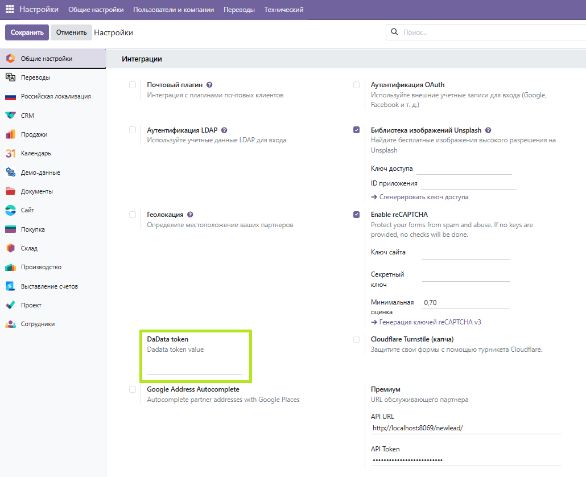
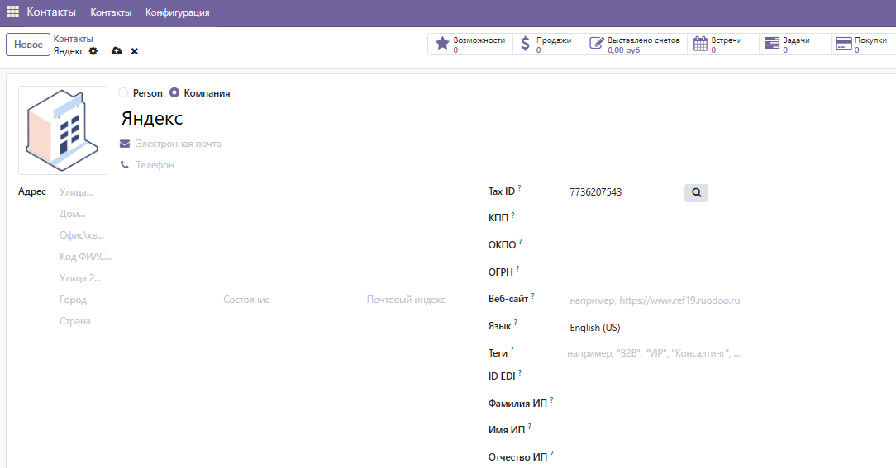
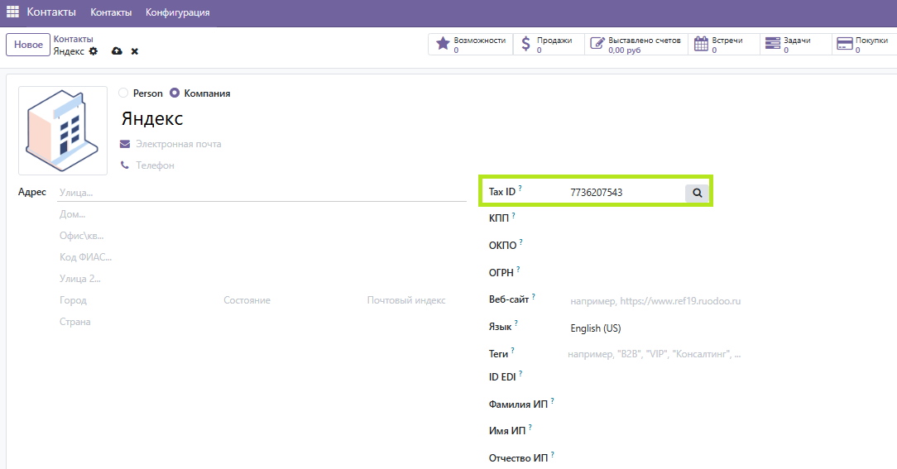
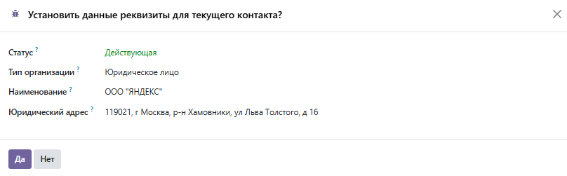
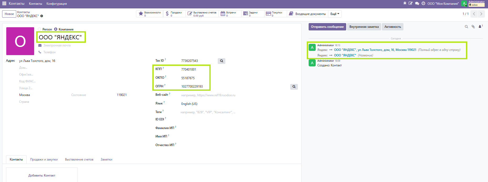

# DaData Connector
name: dadata_connector
version: 19.0.2025.12.03
author: MK.Lab


### 1. Общее описание

Модуль подключает сервис DaData к карточкам контрагентов Odoo. При вводе Tax ID в поле появляется кнопка поиска — нажав её, пользователь получает данные об организации из реестра и может автоматически заполнить всю карточку: название, адрес, КПП, ОКВЭД, руководителя и другие реквизиты.

### 2. Установка

1. Установите Python-пакет на сервере:
```
pip install dadata==21.10.1
```

2. Скопируйте папку `dadata_connector` в директорию `addons`

3. Перезапустите сервер Odoo

4. Обновите список приложений: **Настройки → Приложения → Обновить список**

5. Найдите **«DaData Connector»** и установите

6. Укажите токен DaData: **Настройки → Интеграции → DaData token**

> Токен можно получить на сайте [dadata.ru](https://dadata.ru) после регистрации. Бесплатный план включает 10 000 запросов в день.



### 3. Функциональность

3.1 Что заполняется автоматически:

| Поле в карточке | Откуда берётся |
|---|---|
| Название | Краткое наименование с ОПФ (для юрлиц) или ФИО (для ИП) |
| ИНН | Из реестра DaData |
| КПП | Только для юридических лиц |
| ОГРН | Из реестра DaData |
| ОКПО | Из реестра DaData |
| ОКВЭД | Основной вид деятельности |
| Форма собственности | По коду ОКОПФ |
| Страна, регион, город | Из юридического адреса |
| Улица, дом, квартира | Из юридического адреса |
| Почтовый индекс | Из юридического адреса |
| Руководитель | Создаётся как отдельный контакт-сотрудник |

3.2 Статус организации:

В окне подтверждения отображается текущий статус организации:

| Статус | Отображение |
|---|---|
| Активна | Зелёный цвет |
| Ликвидируется / Ликвидирована / Банкротство / Реорганизация | Красный цвет |

### Пример использования

### Открыть карточку контрагента

Перейдите в **Контакты** и откройте существующего контрагента или создайте нового.



### Ввести ИНН и нажать поиск

В поле **Tax ID** (ИНН) введите идентификационный номер налогоплательщика для организации и нажмите иконку поиска справа от поля.



### Проверить найденные данные

Откроется окно с найденными данными: статус, тип организации, наименование и юридический адрес. Нажмите **Да** чтобы применить, или **Нет** чтобы отказаться.



### Проверить результат

Карточка контрагента заполнится автоматически. Если у организации есть руководитель — он будет добавлен как отдельный контакт в раздел «Контакты» карточки.


